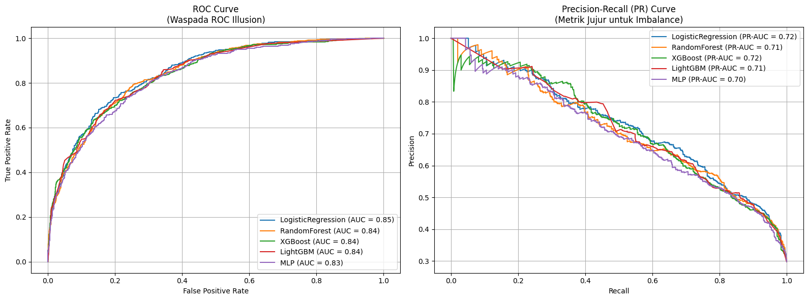
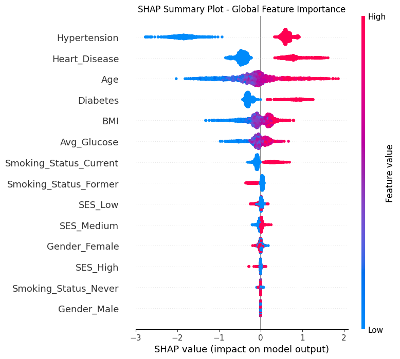

# Shattering the Accuracy Illusion: Predicting Stroke Risk from Imbalanced Health Data


> **View the visual summary and medical impact on my [Portfolio Website ↗]([MASUKKAN_LINK_WEBSITE_PORTOPOLIO_KAMU_DISINI])**

## 📌 Clinical Business Problem
Community health centers (Puskesmas/Posbindu) struggle with delayed stroke referrals because medical staff are overwhelmed manually triaging high-risk patients. 

Building an automated prediction system faces a critical statistical challenge: stroke patients are a severe minority. If a Machine Learning model simply chases standard "Accuracy" or relies purely on ROC curves, it will naturally predict everyone as "Healthy". In a medical context, this results in sending genuinely at-risk patients home a missed diagnosis with life-threatening consequences.

## 🗂️ "Isolation Vault" Architecture & Imbalanced Pipeline
To rigorously evaluate the models without data leakage, I designed an "Isolation Vault" methodology:

1. **Test Set Lockdown:** Conducted a stratified 80:20 split at the very beginning. The 20% test data was locked away and never touched during preprocessing or oversampling.
2. **Leakage-Proof Pipeline:** Built a sealed `ColumnTransformer` + `ImbPipeline` from the `imbalanced-learn` library. Missing values (e.g., BMI) were imputed using the median fitted *exclusively* on training data.
3. **Internal SMOTE Injection:** SMOTE (oversampling) was injected *inside* each Cross-Validation fold (not before the split). This guarantees that synthetic data never leaks into the validation sets, preventing artificially inflated scores.
4. **Algorithm Tuning:** Compared 5 algorithms (Logistic Regression, Random Forest, XGBoost, LightGBM, and MLP) using `GridSearchCV`.

---

## 📊 Key Findings & Medical Insights



### 1. The ROC Illusion: Exposing Honest Metrics
When evaluating the 5 models, ROC curves showed an impressive AUC of >0.83 across the board. However, this is an illusion caused by the massive class imbalance. 

 

By switching to **Precision-Recall (PR) Curves**, the honest performance dropped to a PR-AUC of ~0.72. The PR Curve reveals that detecting the minority stroke class is far harder than the ROC metric suggests. Logistic Regression ultimately proved the most stable for this specific thresholding task.

### 2. Multiplicative Risk Revealed via SHAP
I applied **SHAP (Shapley Additive exPlanations)** based on game theory to open the model's "black box". The feature interaction analysis revealed a critical medical insight: Hypertension combined with Heart Disease does not just create an *additive* risk, it creates an *exponential (multiplicative)* risk. 



### 3. Dynamic Thresholding for Mass Screening
A standard ML threshold defaults to 0.50. However, to prioritize patient safety (Recall), I calibrated a **Dynamic Threshold System**:
* **Threshold = 0.35:** Aggressive screening mode. Flags maximum potential stroke victims for immediate lab testing (used when clinic capacity is high).
* **Threshold = 0.60:** Conservative mode. Used when clinic resources are severely limited, prioritizing only the most absolute high-risk patients.

---

## 💡 Strategic Clinical Recommendations
1. **Never Trust ROC on Imbalanced Medical Data:** Future clinical ML projects must prioritize Precision-Recall AUC and Recall over standard Accuracy and ROC.
2. **Deploy as a Pre-Triage Filter:** Integrate the Logistic Regression model (with a 0.35 threshold) at the Posbindu registration desk to automatically red-flag incoming patients based on basic vital signs before they even see a doctor.
3. **Mandatory Dual-Screening:** Patients flagged by the SHAP interaction analysis (possessing both Hypertension and Heart Disease) must automatically bypass the queue for immediate neurological assessment.

## 📂 Repository Structure
```text
├── Data/
│   └── stroke_data.csv            # Original medical dataset
├── Images/                        # Visualizations (ROC vs PR, SHAP plots)
├── Referensi/                     # Medical references and documentation
├── Notebooks/
    └── Stroke_Risk.ipynb          # Main Pipeline & SMOTE experimentation notebook   
├── requirements.txt               # Dependencies
└── README.md
```

## 🚀 How to Run & Reproduce
* Clone this repository: `git clone https://github.com/Daaffaaisa/Stroke-Risk-Predictions.git`
* Install dependencies: `pip install -r requirements.txt`
* Run Stroke_Risk.ipynb to execute the leakage-proof pipeline, SMOTE cross-validation, and SHAP explainability analysis.
